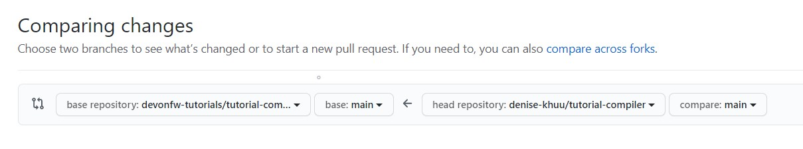

Before starting write content into the tutorial, you have to create a pull request from your newly created branch into the main repository.
This has the advantage that your tutorial will automatically be build and pushed to https://katacoda.com/devonfw-dev. So you can directly test it.

For this step you need to open you local terminal at your forked and cloned &#39;tutorials&#39; folder and run the following commands:
1. &#39;git add .&#39; 
2. &#39;git commit -m &#34;initial commit for tutorial myTutorial&#34;&#39;
3. &#39;git push&#39;

This will save all the changes and push them into your tutorials GitHub repository. 

Switch to your browser and open:
https://github.com/devonfw-tutorials/tutorials

Click on &#39;Pull requests&#39; &gt; &#39;New pull request&#39;.

You might have to click on &#39;compare across forks&#39;.

Select

    * base repository: devonfw-tutorials
    * base: main
    * head repository: [your username]/tutorials
    * compare: [your branch name]

and finally create the pull request by clicking on &#39;Create pull request&#39;.

Write &#39;WIP:&#39; in front of the pull request title to show that you are still working on this pull request. &#39;WIP&#39; stands for &#39;Work In Progress&#39;.

A workflow in the tutorials repository will build the tutorial. Currently the pipeline will fails because a tutorial must contain at least a title, a description and one step.

Let&#39;s fix that and fill the tutorial.

